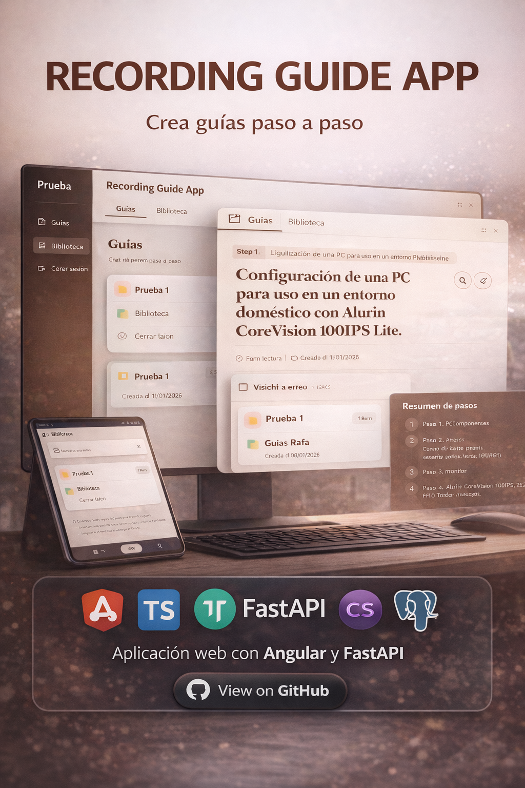
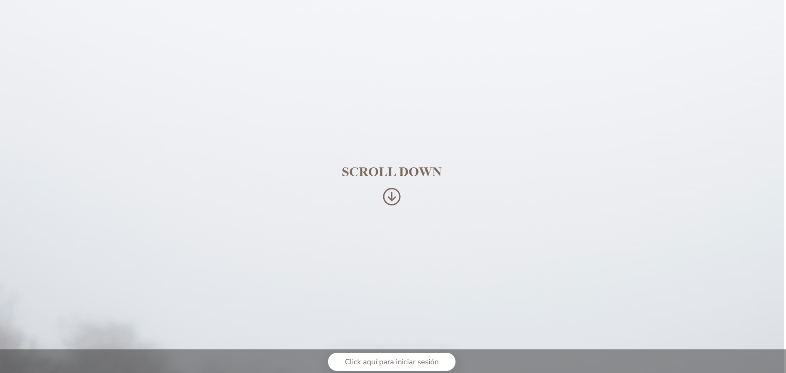
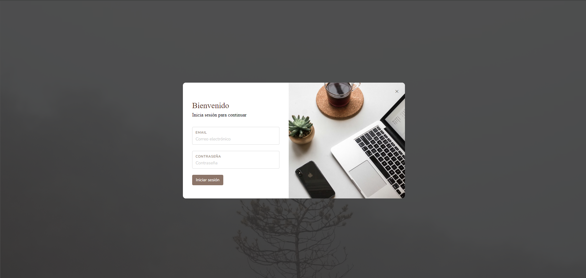
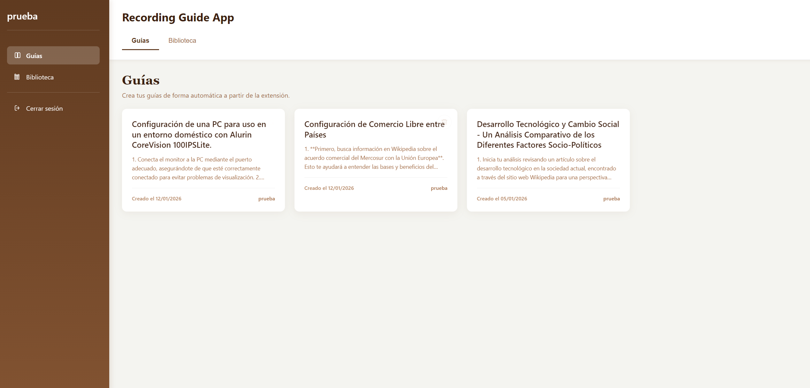
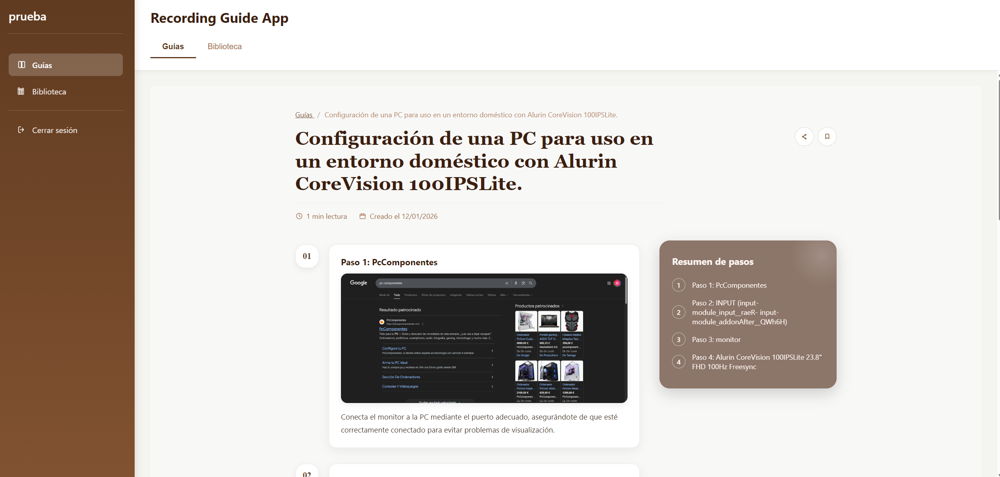
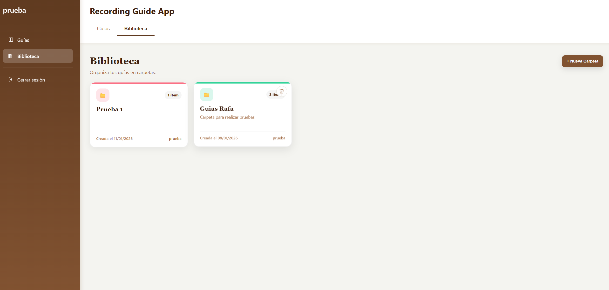
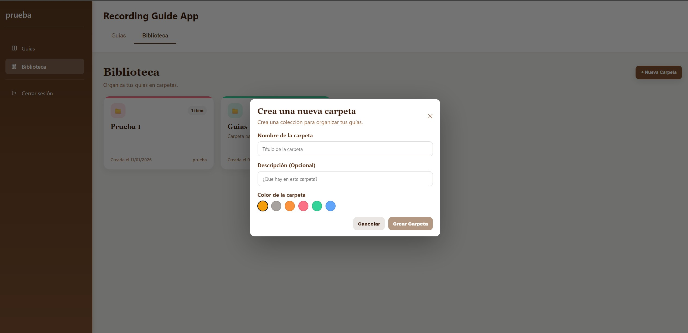
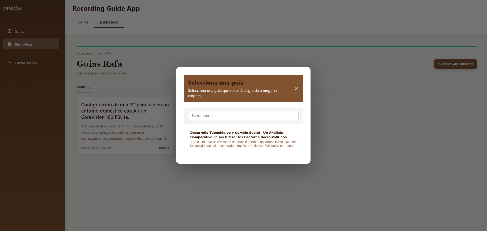
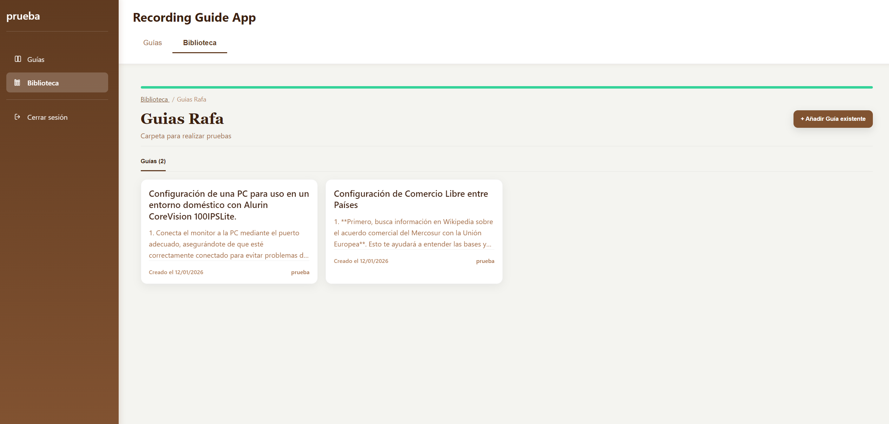

# Recording Guide App

Este repositorio es un **repositorio público de presentación** de *Recording Guide App*.

Aquí se incluye **información general y material visual** de la aplicación.  
El **código fuente no es público** y no se distribuye en este repositorio.

---

## Descripción general

Recording Guide App es una aplicación web orientada a la **creación, grabación y gestión de guías paso a paso de forma automática y visual**, diseñada para facilitar la documentación de procesos y flujos de usuario en entornos profesionales.

La aplicación permite registrar acciones, capturar pasos de usuario y **generar guías de manera automática mediante el uso de IA**, transformando las interacciones grabadas en documentación estructurada, clara y reutilizable. Este enfoque reduce el esfuerzo manual y mejora la eficiencia en la creación de documentación técnica.

Está pensada para contextos donde es necesario:
- Documentar flujos de trabajo de forma precisa
- Crear guías reutilizables y fácilmente actualizables
- Visualizar procesos complejos de manera clara
- **Automatizar la generación de documentación mediante inteligencia artificial**

---

## Funcionalidades principales

- Grabación de flujos de usuario paso a paso mediante captura de acciones e interacciones.
- Generación automática de guías estructuradas a partir de los pasos grabados, apoyada en inteligencia artificial.
- Organización de guías en bibliotecas y carpetas para una gestión clara y reutilizable.
- Visualización detallada y ordenada de cada guía, incluyendo pasos, capturas y resúmenes.
- Interfaz limpia y profesional orientada a la usabilidad y la comprensión del proceso.
- Arquitectura diseñada para ser escalable y adaptarse a distintos tipos de flujos y usuarios.

---

## Capturas de la aplicación

### Pantalla de login

### Pantalla principal

### Detalle de guía

### Biblioteca de guías

### Crear nueva carpeta

### Añadir guías a carpeta

### Detalle de carpeta

---

## Tecnologías utilizadas

- Frontend: Angular, TypeScript, HTML, SCSS
- Backend: FastAPI, Python
- Base de datos: PostgreSQL, Supabase
- Arquitectura: API REST

## Código fuente

El código fuente de este proyecto es **privado** y no forma parte de este repositorio.

Si estás interesado en una demo o más información, puedes ponerte en contacto conmigo.
